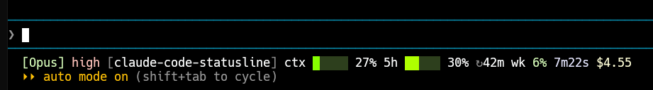
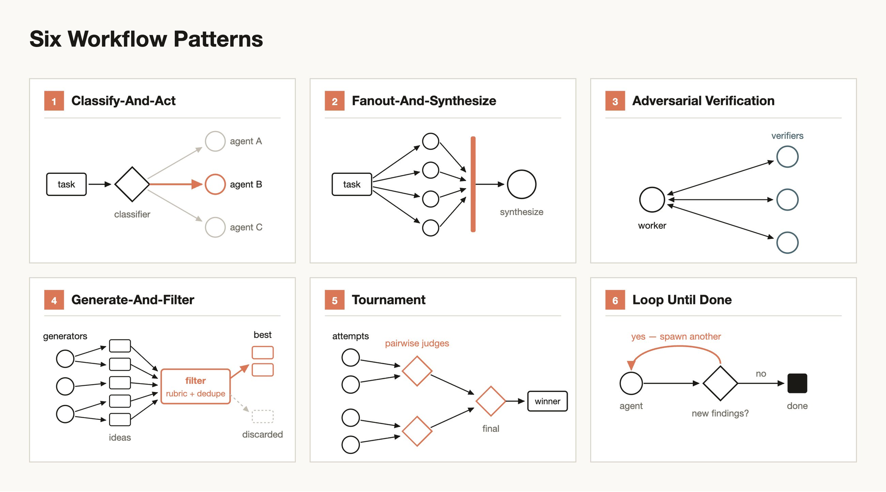

> *Up front, to be fair: this article was written with Claude Code (AI) — as were the code, the benchmarks, and the charts. The voice is modeled on my own past, non-AI articles; the model followed a [style guide](https://github.com/radumarias/claude-code-statusline/blob/main/docs/style-guide.md) reverse-engineered from them. My human writing: [medium.com/@xorio42](https://medium.com/@xorio42).*

Hi,

First, for anyone who doesn't use Claude Code: it's an AI coding assistant that runs in your terminal, and a **status line** is the little bar along the bottom of it. Mine shows, at a glance, which model you're on, how much of the context window you've burned, how much of your usage budget is left, and what the session has cost — a tiny dashboard so you're not flying blind. This is the story of making that little program as fast as I could.

It all started by accident. I stumbled on the `/statusline` command inside Claude Code one day and had no idea what it was about, so I went looking. I read the [docs](https://code.claude.com/docs/en/statusline), and right there at the top is an example **status line** — two lines, model and folder and a little context — and it looked really nice.


*Claude Code's default two-line status line — the docs example that started it.*

And then I got curious, the way you do: could I make something similar, but **one line** and more compact? A status line reads a JSON envelope on stdin, prints one colored line, and exits. That's it. So I tried, and ended up with something like this:

```
[Opus] high  [my-project]  ctx ██░░░ 42%  5h ████░ 85% ↻2h30m  wk 10%  1h16m  $11.55
```

One honest aside, because it's kind of the whole point of a small experiment like this: all of it was vibe coding. I do **not** generally encourage that — but for experiments, PoCs, and little learning projects, it's great, and this was exactly that.

Then a **friend** asked me to send him the config, so I quickly spun up a GitHub repo with Claude Code to share it. Which, side note, is lovely — Claude Code's install-by-prompt: you hand it a prompt plus a repo and it installs everything for you, no copy-paste dance. Neat.

But then **another friend** in the same group looked at it and said it was too slow :)) — and this was when it ran in ~5–15 ms. So I rewrote it in **Rust**. When it got down to ~1 ms, that same friend said: fast, you don't even feel it — but not the fastest it can be. So I said "hold my beer," and went down one of the most instructive rabbit holes I've been in for a while.

Because here's the thing — the status line runs *constantly*, after every message and on an idle timer, so you pay that startup cost over and over. And that turned it into a really nice learning project around one question: how low can a process spawn go? I learned a lot here, so I wanted to write it down. Let the journey begin.

And here's the part that frames everything below: the actual logic runs in **~6 microseconds**. ~99% of every run is the OS spawning a process. Almost everything below is the story of optimizing *that* — and of a benchmark that turned out to be the biggest bug of all.

## Bash: you have to think in forks

The original script forked `jq` once per field — 12 launches, ~48 ms out of ~73 ms total. *Aargh.* So the first realization was that the real currency here is **forks**, not lines of code.

First win: **one `jq` call** for all fields, joined with an ASCII Unit Separator (`0x1f`) — not a tab, because the shell's `IFS` collapses tabs and would silently drop empty fields and shift every later column.

```bash
IFS=$'\x1f' read -r model effort dir ctx five_h ... < <(
  jq -rj '[.model.display_name, .effort.level, .workspace.current_dir, ...]
          | join("")' <<<"$input"
)
```

Then **replace every other subprocess with a builtin**. This is where bash is actually `performant`, if you let it be:

```bash
folder=${dir##*/}            # not: basename "$dir"
now=$(printf '%(%s)T' -1)    # not: date +%s
printf -v cost '%.2f' "$raw" # not: echo | awk
IFS= read -rd '' input       # not: input=$(cat)   ← the stdin read, fork-free
```

One gotcha that cost me time: `input=$(</dev/stdin)` reads **empty** under Claude Code's stdin piping and blanks every field. So you have to test against the real pipe, not a synthetic one. I learned that the hard way :)

Result: **~6 ms with 1 fork.** And a session-keyed cache that reprints the last line *before* the `jq` parse even runs: **~1.8 ms, 0 forks.** Already pretty good for a `simple` script.


*What I built: one compact line — model, folder, context + 5-hour usage bars, weekly quota, elapsed time, and cost.*

## Rust: meeting the wall

Then I thought, how about a native binary. I rewrote it in **Rust** — a hand-written recursive-descent JSON parser, **zero external crates** (offline build, tiny binary), output byte-identical to the script. A `parity-check.sh` diffs both across 14 envelopes so they can never drift apart. The render function is pure — `render(input, now)` with the clock injected — so it's deterministic and testable. I really appreciate the `compiler` here; once it's green, you mostly trust it. After you understand why it lets you do things, you start to think that's the **correct** way to do them.

So I measured the logic with a million-iteration micro-bench, fully expecting to find something to optimize:

```
parse JSON               ~2933 ns
render_parsed (format)   ~2373 ns
render (parse+format)    ~5696 ns   ← the whole logic: ~0.006 ms
render_bar (one bar)      ~309 ns
```

**~6 µs.** The render you actually see on screen is rounding error. ~99% of every invocation is process spawn. And this is the lesson that reframed the whole project for me: you can't optimize code that isn't the bottleneck. An empty `fn main(){}` spawns just as fast as mine.

## So optimize *being a process*

If the code isn't the cost, the levers all live in the spawn path.

**Static linking** — no `ld.so` mapping shared libs at launch, ~25–35% off spawn:

```toml
# .cargo/config.toml — scoped to Linux (macOS has no static libc)
[target.'cfg(target_os = "linux")']
rustflags = ["-C", "target-feature=+crt-static"]
```

**Skip the runtime preamble** with `#![no_main]` and a C `main` — this bypasses std's `lang_start` (the stack-overflow guard + the SIGPIPE handler):

```rust
#![no_main]

#[no_mangle]
pub extern "C" fn main(_argc: i32, _argv: *const *const u8) -> i32 {
    // read stdin → render → write → flush explicitly (no lang_start to do it for us)
    0
}
```

This is safe because the output line is `< PIPE_BUF`, so the single `write` is atomic.

**Switch to musl.** Static glibc bloated the binary to 1.07 MB; musl brings it down to 431 KB with far fewer startup relocations:

| build | size | warm spawn (min) | self-relocs |
|---|---|---|---|
| dynamic PIE | ~334 KB | ~0.57 ms | — |
| static glibc | ~1.07 MB | ~0.38 ms | 1475 + 23 |
| **static musl** | **~431 KB** | **~0.34 ms** | **400 + 0** |

```bash
rustup target add x86_64-unknown-linux-musl
cargo build --release --target x86_64-unknown-linux-musl
```

That's **2.5× smaller**, relocs 1475→400 and 23→0. The warm-spawn gain is real but small — only ~0.04–0.09 ms — so footprint is the bigger win. The one place size actually matters is the **cold** page-cache regime: musl pays **+0.50 ms** there vs glibc's **+0.78 ms**, faulting ~3× fewer pages.

And one last `execve` detail that's easy to miss: **use an absolute path** in `settings.json`. A `~`-prefixed command isn't `execve`-able, so it gets routed through a `/bin/sh` wrapper — that's ~0.7–0.9 ms of pure bash startup you pay every single call.

```jsonc
// settings.json — write the absolute path, NOT ~/.claude/...
"command": "/home/you/.claude/claude-statusline"
```

## Then I let 89 agents argue about it

At this point I didn't want to keep *guessing* what to optimize. So I ran a structured multi-agent brainstorm — an "ultracode" workflow where some agents propose optimizations and *other* agents adversarially refute each one, and everyone has to actually build and measure. Actually I ran **three** of these adversarial brainstorms in parallel, for variety and so they'd cross-check each other — the ~89 agents and 169 ideas below are the totals across all three. I ran it with Claude Code's new [dynamic workflows](https://claude.com/blog/introducing-dynamic-workflows-in-claude-code) (see the [launch post](https://x.com/trq212/status/2061907337154367865) too) — which honestly was the perfect tool for this, because the brainstorm *is* one of those patterns: fan out a lot of agents to generate, point adversarial agents at the ideas to refute them, then generate-and-filter down to what survives.

Here's the actual prompt I kicked it off with — typos and all, I'm leaving it exactly as I typed it:

```
/effort ultracode
- analyze the whole flow for native and find ways to optimize even more, use also dynamic workflow
- organize a brainstorming session between muliple agents, lunch several agents to emit ideas and other to refute them
- most of the agents have them use Opus latest model but make some agents, randomly like 10-30% of them, use Sonnet latest model, for variety, and also have different effort levels selected for them also randomly between all agents like [high, xhigh, "ultracode", max]
- run this for 30m and show me the results
```


*The six dynamic-workflow patterns (credit: @trq212). The brainstorm leaned on Fanout-and-Synthesize, Generate-and-Filter, and Adversarial Verification.*

**89 agents**, mixed models and effort levels:

- **Brainstorm** — 120 ideas across 14 lenses
- **Debate** — +49 more, 6 angles → 169 raw ideas
- **Curate** — down to 22 canonical candidates
- **Refute** — each judged through 3 adversarial lenses (impact / constraint / measurability), **default-refuted** — an idea only survives if a majority of lenses fail to kill it

The agents didn't reason in the abstract — they built real musl binaries, an empty-`main` floor, ran `readelf`, `gdb` catchpoints, `getrusage` fault counts. Neat to watch, honestly.

**Result: 22 canonical → 6 kept, 16 rejected. Exactly one — musl — moved measurable wall-clock.** The dead-ends are the real value here, so I'm keeping the whole ledger so nobody re-proposes them without new evidence:

- **Daemon/socket front-end** (keep it resident) — *net regression*, ~2.2× slower (7.4 ms vs 3.3 ms), because Claude Code forks a client per call anyway.
- **`taskset` core-pinning** (to reduce variance) — made p50 **~10× worse** on a hybrid CPU.
- **`target-cpu=native` / PGO / `build-std`** — these only recompile the 6 µs logic; they can't touch glibc's prebuilt resolvers, PGO breaks the offline build, and `build-std` is nightly.
- **Static no-PIE, strip `.eh_frame`, `-z norelro`, self-provided `memcpy`** — sub-noise, or already subsumed by musl.
- **Logic micro-opts** (preallocated `String`, zero-copy `Cow` parser, hand-rolled `itoa`) — all sub-µs, and `itoa`/integer-cents also **broke output parity** (round-half-away vs `%.2f`'s round-half-to-even). Not worth it.

Then freeze the win so it can't quietly regress:

```bash
# parity-check.sh hard-fails if the binary ever links dynamically
if file -b "$BIN" | grep -qi 'dynamically linked'; then
  echo "FAIL: $BIN is dynamically linked (expected static)." >&2
  exit 1
fi
```

## But the biggest bug was the benchmark itself

Here's the part I'm a little embarrassed about, but it's the most useful thing I learned, so I'll leave it in. I had been reporting **~1.1 ms** warm spawn for a long time. The harness timed each sample like this:

```bash
s=$(now_us); "$BIN" < "$ENV" >/dev/null; e=$(now_us)   # ← two $(...) = two forks
```

Each `$(...)` forks a subshell. **Two per iteration.** That phantom ~0.8–1.7 ms made `/bin/true` and my real binary indistinguishable — I was measuring the ruler, not the thing. The fix is to capture `$EPOCHREALTIME` with no fork at all:

```bash
printf -v s '%s' "$EPOCHREALTIME"; "$BIN" < "$ENV" >/dev/null; printf -v e '%s' "$EPOCHREALTIME"
```

True warm spawn: **~0.4 ms.** So the biggest single correction in this whole project wasn't a speedup — the benchmark was just overcounting.

One bonus trap: `/usr/bin/true` is **dynamically linked**, so it actually spawns *slower* than my static binary, which gave me confusing negative "binary − baseline" deltas. The honest baseline is a same-profile empty-`main` Rust binary (`floor.rs`) — that's what attributes spawn vs logic correctly.

## The honest conclusion

So where did the `journey` land? ~0.34 ms warm spawn, zero forks, under 1 MB. And — I have to be honest — it doesn't really matter. A once-a-second status line is imperceptible whether it's 6 ms or 0.3 ms. **The native edge is footprint, not felt speed.** So the bash script stays the default (it needs only `jq` + bash, and it's trivially auditable); the native binary is an opt-in for people who want a tiny, zero-fork footprint and already have `cargo`. Both render byte-identically.

Three things I'm taking with me:

1. **Measure the right layer.** ~99% of the cost was spawn; the code was never the bottleneck.
2. **Trust your benchmark last.** Validate the ruler before the thing you measure.
3. **Adversarial review beats brainstorming.** 169 ideas were cheap; curating them to 22, then refuting all but 6 of those — with evidence — was the value.

Don't get me wrong — none of this is software craftsmanship taken to perfection, it's just a small tool. But it taught me a lot about where time actually goes when you spawn a process, and that's the kind of thing **Rust** keeps quietly teaching me. Learning it was one of the best decisions I made, and projects like this are how I keep learning :)

## What I'd try next

One honest limitation I keep coming back to: the refute stage stopped at *argument*. The agents judged each candidate optimization on paper — a verdict, not a measurement. That's already a big step up from a plain brainstorm, but hey, the natural next step is to let every surviving idea actually get **built and benchmarked for real**, in isolation, and then pick the winner from measured data instead of from a verdict.

And the nice thing is dynamic workflows can already do this. You can give each agent its own git **worktree** (`isolation: worktree`), so a refute/implement stage spins up one worktree per candidate, implements that idea there, runs the benchmark *in that worktree*, and reports its numbers back — and the final selection is made from the real benchmark data across all the worktrees. I would imagine that's a much more honest funnel than the one I ran. You do **not** need a separate "agent teams" feature for this — you can just instruct the dynamic workflow to do exactly that in the prompt.

This is the part I find genuinely exciting. Claude Code has been shipping a whole little family of these — subagents, an agent view, [agent teams](https://code.claude.com/docs/en/agent-teams), programmatic MCP/API/CLI calls (similar in spirit to dynamic workflows but aimed at MCP/APIs/CLI, and at generating CLIs), and now dynamic workflows — which is basically agent logic running *inside* the agent. That last one is the powerful one: it's what let me express the fan-out → refute → curate dance in the first place, and it could express this worktree-benchmark-select loop just as naturally.

Full source, the honest harness, and the whole rejected-ideas ledger are in [the repo](https://github.com/radumarias/claude-code-statusline) — come look, fork it, break it, send a PR. And if you've got a lever that beats the `execve` floor, plese show me the measurement :)

And one more time — thank you to the friends in that little group. To the one who asked for the config in the first place, and especially to the one who kept heckling the speed: "too slow," then "fast, but not the fastest it can be." That ribbing is the whole reason any of this exists — it kept nudging me one rabbit hole deeper, and it turned into one of the most fun things I've learned in a while. Thank you :)

Let the journey begin. To be continued…


<!-- dev.to note: the images (assets/default-statusline.png and assets/six-workflow-patterns.png) are paths relative to this file (they resolve to docs/assets/) so they render on GitHub. On dev.to you must upload each image and replace the path with the uploaded URL. -->
