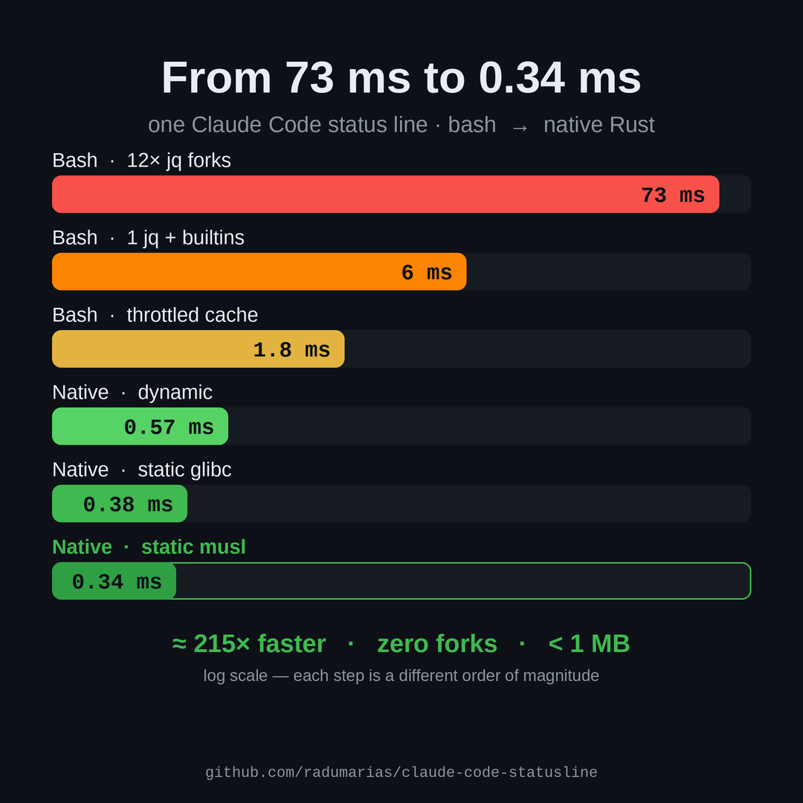
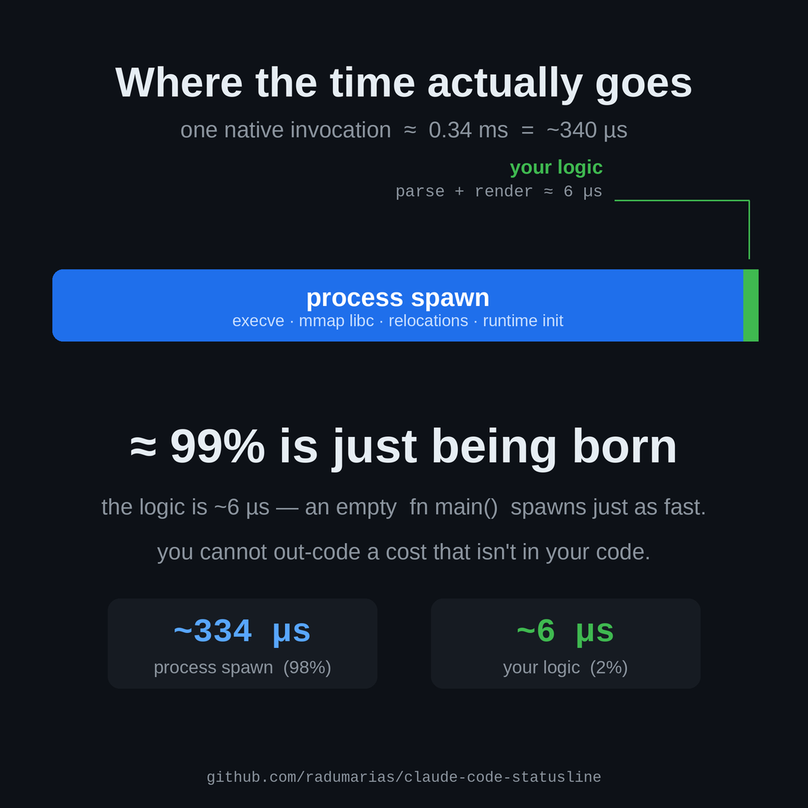
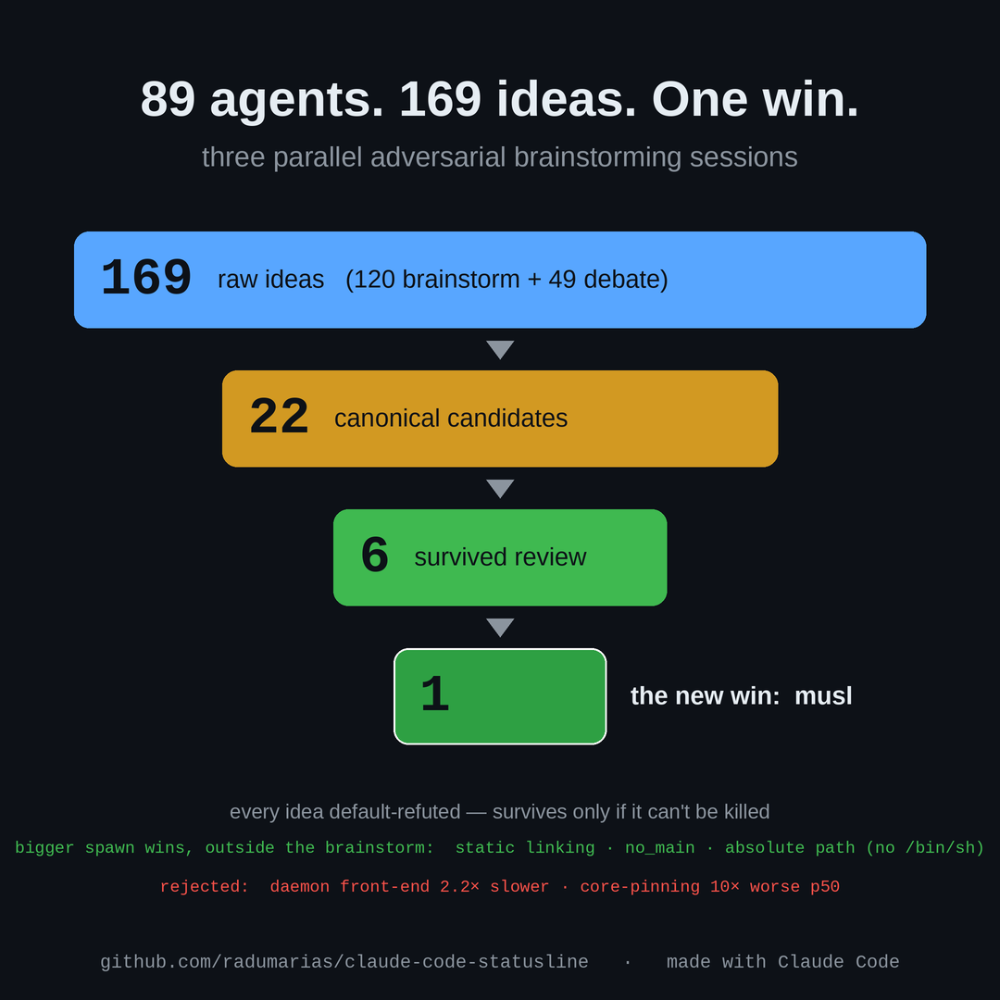

# Medium article

> Paste below the divider into Medium; tables converted to prose since Medium doesn't render Markdown tables.

---

# The six-microsecond program

## How a tiny status line for Claude Code took me from a bash script to a native Rust binary — and how I found out my own benchmark had been lying to me the whole time

It all started by accident. I was poking around inside Claude Code and stumbled on the `/statusline` command, and I had no idea what it did, so I wanted to see what it was about. I read the docs to find out: https://code.claude.com/docs/en/statusline

The docs show an example status line, two lines, and it looked nice.


*Claude Code's default two-line status line — the docs example that started it.*

And I got curious. Could I make something similar, but one line and more compact? That was the whole idea. Nothing grand.


*What I built: one compact line — model, folder, context + 5-hour usage bars, weekly quota, elapsed time, and cost.*

I should be honest about how I built it: all of it was vibe coding. I don't generally encourage that, please don't take this as me telling you to do it. But for experiments, PoCs, and little learning projects like this one, it's great, you get to chase a curiosity without ceremony.

Then a friend asked me to send him the config. So I quickly spun up a GitHub repo with Claude Code to share it, and I have to say, Claude Code's install-by-prompt is lovely, you hand it a prompt and a repo and it installs everything for you. No README archaeology, no copy-pasting paths.

And then another friend, in the same group, said it was too slow :)) This when it ran in about 5 to 15 ms. So I rewrote it in **Rust**. And when it got down to about 1 ms, that same friend said: fast, you don't even feel it, but not the fastest it can be. So I said "hold my beer," and went off to push it even lower.

The thing itself is almost a joke: a **status line** for Claude Code. That little bar at the bottom of the terminal that shows which model you're on, how much context you've burned, your rate-limit budgets, and the session cost. It reads a JSON envelope on stdin and prints exactly one line, something like `Opus / high / my-project / ctx 42% / 5h 85% / wk 10% / $11.55`, and then it exits. And Claude Code runs it again and again, after every message, on a timer when you're idle. So the startup cost gets paid over and over. That repetition is what turned a toy into a real little performance problem, and I couldn't let it go. I wanted to see how low it could go.


*The whole journey, from a 73 ms bash script down to a 0.34 ms musl binary.*

I learned more from this tiny thing than from projects ten times its size. The smallest programs make the best teachers, I think, because there's nowhere for a sloppy assumption to hide.

## Stage one: stop forking so much

The first version was a bash script, and it had the classic shell disease. It forked a subprocess for everything. It called the JSON tool `jq` once for *each* field it pulled out of the envelope. Twelve fields, twelve process spawns. When I profiled it, the original was around **73 ms per call**, and roughly **48 ms of that was just `jq` starting and stopping**. Twelve times.

So I started thinking in terms of forks, because that's the unit that actually costs you here. One single `jq` call that emits every field at once, joined by an obscure separator, the ASCII Unit Separator `0x1F`, because a tab would get collapsed by the shell's field splitting and silently drop the empty fields and shift every later column. Neat little trap, that one.

Then every other subprocess got replaced by a bash builtin. The external `basename` became a parameter expansion. Calling out to `date` for the timestamp became a `printf` format. Piping to `awk` for math became `printf` into a variable. And reading stdin with a subshell became a plain `read` builtin. That last one has a subtle trap. The obvious way of slurping stdin reads *empty* under Claude Code's particular way of piping it in, which would blank every field. You only learn that by testing against the real pipe, not a fake one. I learned it the hard way :)

The result: **about 6 ms with one fork** (best run 5.87), with the transient footprint around 6.7 MB. Then I added a small cache, reprint the last line if it's still fresh, keyed on the session ID, and the common case dropped to **about 1.8 ms with zero forks** (best 1.76), around 3.5 MB.

For any reasonable person, this is where the story ends. The thing runs once a second, six milliseconds is invisible. But I wanted the floor.

## Stage two: the rewrite, and the wall

So I reimplemented the whole thing as a native **Rust** binary. A hand-written recursive-descent JSON parser, **zero external crates**, so it builds offline and stays tiny, and, importantly, output that is *byte-for-byte identical* to the bash script. I enforce that with a parity checker that pipes 14 different envelopes through both and diffs them. If the binary and the script ever disagree by a single escape code, the build fails. The `render` function takes the input and the current time as an argument, with the clock injected in, so it's pure and deterministic and testable. After you spend enough time with the **borrow checker** you start writing things this way without thinking, and you appreciate why.

Then I profiled the Rust. And I hit the wall that reframes this whole story.

The actual logic, parse the JSON, format the line, build the colored bars, runs in **about six microseconds**. Not milliseconds. Microseconds. I measured each stage with a million-iteration micro-benchmark, with warmup, and the whole render comes out at about **5,696 ns, which is around 0.006 ms**.

Everything else, and "everything else" is **about 99% of every real invocation**, is the operating system *spawning a process*. Loading the executable, mapping its libraries, running the language runtime's startup before `main` even begins, then tearing it all down.


*Where every invocation actually spends its time — about 99% is being born, about 1% is the logic.*

So here is the thing I keep coming back to: **you cannot out-code a cost that isn't in your code.** An empty `main` compiled with the same settings starts at the same speed as my fully-functional binary. The render loop was never the problem. The problem was being born.

## Stage three: optimizing *being a process*

Once the target shifts from "the code" to "the spawn," a different toolbox opens up, and this is where it got genuinely fun.

**Static linking.** A dynamically-linked binary, at every single launch, invokes the dynamic linker to find and map shared libraries. Statically link it, bake libc in, and that whole dance disappears. Worth roughly 25–35% of spawn time. Safe here only because the binary does no hostname or user lookups, which are the things that secretly need a dynamic libc.

**Skip the runtime preamble.** Rust's standard entry point is wrapped in a small startup routine that installs a stack-overflow guard and a SIGPIPE handler before your code runs. Skipping it with a C-style entry point (`#![no_main]` plus a C `main`) saves a handful of syscalls. Safe because our line is smaller than a pipe buffer, so a single `write` is atomic.

**Switch to musl.** Statically linking glibc, ironically, *bloated* the binary to 1.07 MB. The **musl** libc gives a **431 KB** static binary instead, 2.5× smaller, and with far fewer startup relocations to chew through. The relative relocations go from 1475 down to 400, and another category from 23 down to 0. The agents and I checked this with `readelf`, not vibes.

**Use an absolute path.** This one is almost funny. The config that tells Claude Code what to run originally used a tilde-relative path. But the kernel does not expand the tilde when it execs a program, so a tilde-prefixed command silently gets routed through a `/bin/sh` wrapper, which means you pay for a *whole bash startup*, around 0.7–0.9 ms, just to launch your 0.3 ms binary. Writing the absolute path makes the OS exec it directly. *Aargh.*

So where did all of this land, in numbers? The bash script is about 6 ms, or about 1.8 ms throttled, 1 fork or 0. The dynamic Rust binary is 334 KB and warm-starts in about 0.57 ms with zero forks. Static glibc is bigger at 1.07 MB but faster, about 0.38 ms. And the static musl build, the one the native installer prefers when you have the target installed, is **431 KB and warm-starts in about 0.34 ms with zero forks**. The musl-vs-glibc speed difference is real but tiny, only about 0.04–0.09 ms, so honestly the footprint is the bigger win. The one place size actually bites is a cold page cache: musl pays +0.50 ms there, from 0.336 to 0.834, glibc pays +0.78 ms, from 0.402 to 1.179, because musl faults roughly 3× fewer pages.

## Stage four: 89 agents, and the value of being refuted

Here's where I did something I hadn't done before. Rather than keep guessing at optimizations, I ran a structured brainstorm as an "ultracode" workflow, a swarm of **89 agents**, mixed models and effort levels, with one rule: *some of you propose ideas, others adversarially try to kill them, and nobody wins an argument without a measurement.* Actually, to be precise, I ran three of these adversarial brainstorms in parallel, for variety and to let them cross-check each other, and the ~89 agents and 169 ideas are the totals across all three.

I ran the whole thing with Claude Code's new **dynamic workflows**, which is what made a swarm this size actually manageable. If you want to read about them, the announcement is here: https://claude.com/blog/introducing-dynamic-workflows-in-claude-code and the launch post is here: https://x.com/trq212/status/2061907337154367865

And honestly the best way to show you what I did is to just give you the prompt I kicked it off with, typos and all:

```
/effort ultracode
- analyze the whole flow for native and find ways to optimize even more, use also dynamic workflow
- organize a brainstorming session between muliple agents, lunch several agents to emit ideas and other to refute them
- most of the agents have them use Opus latest model but make some agents, randomly like 10-30% of them, use Sonnet latest model, for variety, and also have different effort levels selected for them also randomly between all agents like [high, xhigh, "ultracode", max]
- run this for 30m and show me the results
```

What's neat is that the brainstorm itself turned out to be an instance of the dynamic-workflow patterns, without me planning it that way. Fanning out to a swarm to generate ideas, adversarial verification to refute them, and generate-and-filter to curate down the survivors, those are the exact shapes.


*The six dynamic-workflow patterns (credit: @trq212). The brainstorm leaned on Fanout-and-Synthesize, Generate-and-Filter, and Adversarial Verification.*

The pipeline was Brainstorm, 120 ideas across 14 lenses, then Debate, +49 more from 6 angles, so 169 raw ideas in total. Then Curate, down to **22 canonical candidates**. Then Refute, where each candidate is judged through 3 adversarial lenses, impact, constraint, and measurability, and the default verdict is *refuted*. An idea survives only if a majority of the lenses can't kill it.


*The funnel: 169 raw ideas down to 22 candidates, 6 kept, and exactly 1 that moved the wall clock.*

Of the 22: **6 kept, 16 rejected, and exactly one, the musl build, actually moved the wall clock** in a way you could measure. And these agents didn't just argue. They built real binaries, inspected them with `readelf`, traced syscalls, counted page faults. They measured.

The reject pile taught me more than the keep pile, so let me walk through it.

A **daemon behind a socket** to keep the program resident, the kind of "obvious" win you'd whiteboard in a meeting, measured **about 2.2× slower** (7.4 ms vs 3.3 ms). Claude Code forks a client process per call regardless, so you pay spawn cost *plus* a socket round-trip to replace six microseconds of work.

**Pinning the process to a CPU core** with `taskset` to reduce timing variance made the median latency roughly **10× worse** on a modern hybrid performance/efficiency-core CPU.

**`target-cpu=native`, profile-guided optimization, recompiling the standard library.** All of these only touch the six microseconds of logic, they can't touch glibc's precompiled internals, and they variously break the offline build or need nightly Rust.

**Static no-PIE** saved about 10 µs, below noise, and it costs you ASLR. Subsumed by musl anyway.

A dozen **logic micro-optimizations**, a single preallocated render string, gradient-escape constants, pre-sized vectors, a zero-copy parser, a hand-rolled number formatter. All sub-noise. And the hand-rolled number formatter had a worse sin, it **broke output parity**, because integer-cents arithmetic rounds half-away-from-zero while both Rust's and bash's formatting round half-to-*even*. Values that land exactly on a rounding boundary would disagree.

And **stripping the unwind tables, disabling relro, providing our own memcpy**. Demand-paged dead bytes, or sub-microsecond. No real payoff, subsumed by musl.

Six microseconds of logic. None of the code optimizations could ever matter, and the swarm proved it one refutation at a time. A good skeptic with a compiler is worth a hundred enthusiastic suggestions, I would imagine.

## The twist: the benchmark was the bug

The single most consequential discovery in this whole project was not a speedup. It was that my benchmark had been lying to me.

I'd been confidently reporting **about 1.1 ms** warm spawn for the native binary. But the harness timed each sample by grabbing the time before and after with command substitution. And in bash, every command substitution **forks a subshell.** Twice per iteration. That phantom overhead, easily 0.8 to 1.7 ms, was so large it made `/bin/true` and my optimized binary statistically *indistinguishable*. I had been measuring the ruler, not the object.

Replacing it with a `printf` that captures the high-resolution clock variable directly, no fork, revealed the truth: **about 0.4 ms**. The README now carries a permanent confession about it. The biggest single correction in the entire project wasn't a speedup at all, the benchmark itself had been overcounting by about 0.8 ms.

There was a companion gotcha too. My naive baseline, `/usr/bin/true`, is *dynamically* linked, so it actually spawns *slower* than my static binary, which produced nonsensical negative "binary minus baseline" numbers until I built a same-settings empty-`main` Rust binary to serve as an honest floor. It never ships. It just sits between `/usr/bin/true` and the real binary to show that spawn is far bigger than logic.

## What it was actually about

Final tally: the binary warm-starts in about 0.34 ms, zero forks, in under half a megabyte. By any measure, it's fast.

And it does not matter. A status line that runs once a second is imperceptible whether it takes 6 ms or 0.3 ms. The honest conclusion, which now lives in the project's own docs, is that **the native edge is footprint, not felt speed.** So I kept the humble bash script as the default, the one that just needs `jq` and bash, and made the native binary an opt-in for people who specifically want a tiny, zero-fork footprint. Both render byte-identically.

So what was the point? Three things I'll carry into work that actually matters.

**Measure the right layer.** I spent hours optimizing code that was 1% of the cost. The expensive thing was process spawn, and no cleverness in the render function could touch it. Find the dominant cost before you optimize anything.

**Trust your benchmark last.** The most embarrassing bug wasn't in the program, it was in the instrument. Before you believe a number, validate the thing producing it. A ruler that forks two subshells per measurement will confidently report fiction.

**Adversarial review beats brainstorming.** The 169 ideas were cheap. The value was in the agents whose only job was to *kill* ideas with evidence, and who killed 163 of them. Don't get me wrong, I'm not saying throw a swarm at every problem. But a structured argument where nobody wins without a measurement, that part I'll keep.

## What I'd try next

There's one thing about the refute stage that still nags at me a little. For all its discipline, it stopped at argument. The agents judged each candidate optimization *on paper*, through those three adversarial lenses, and handed down a verdict. Which is great, and it was right far more often than I'd have been on my own, but a verdict is still a guess with good footnotes. The honest next step is to stop trusting the argument and let each surviving idea actually get **built and benchmarked for real**, in isolation, and then pick the winner from measured data instead of from a majority of lenses. Refute on paper, sure, but then prove it on the bench.

And the neat part is that dynamic workflows can already do this, no new feature required. You can hand each agent its own git **worktree**, so a refute-and-implement stage spins up one worktree per surviving candidate, implements that one optimization there, runs the benchmark inside that worktree, and reports its real numbers back. Then the final selection isn't a verdict at all, it's just whoever posted the best measured spawn time across all the worktrees. Worktree isolation means the candidates never step on each other, and the whole thing collapses back into the same fan-out then curate dance I already had, only now the "curate" step is reading wall-clock instead of reading arguments. And to be clear, you do *not* need a separate "agent teams" feature to pull this off, you can just instruct the dynamic workflow to do exactly that, in the prompt. That's the part I find genuinely exciting.

Because honestly, Claude Code has been shipping a whole little family of these lately, and watching them line up is a treat: subagents, an agent view, agent teams, programmatic MCP/API/CLI calls (similar in spirit to dynamic workflows but aimed at MCP, APIs, and CLIs, even generating CLIs), and now dynamic workflows, which is basically agent logic running *inside* the agent. That last one is the powerful one. It's what let me express the fan-out then refute then curate dance in the first place, and I would imagine it could express this worktree-benchmark-select loop just as naturally.

The full source, the benchmark harness, the parity checker, and the complete ledger of rejected optimizations are all in the repository: https://github.com/radumarias/claude-code-statusline. Feel free to fork it, change it, use it however you want. And if you've got a lever that genuinely beats the spawn floor, please write me, I'd love to see the measurement :)

And a real thank you to the friends who heckled this thing into existence. To the one who asked for the config in the first place, that's the spark. And especially to the one who kept needling me about the speed, too slow, then fast but not the fastest, that ribbing is what drove the whole thing, every stage of it. It's funny how a couple of offhand messages in a group chat can hand you weeks of learning. Thank you :)

Let the journey begin. To be continued…

> Built with Claude Code — the code, the benchmarks, the charts, and this article.
